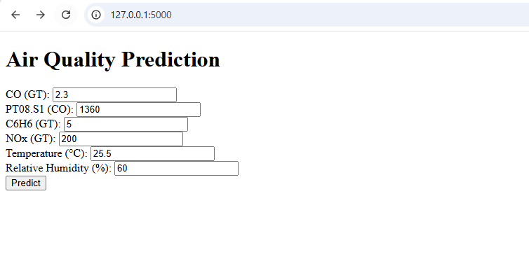
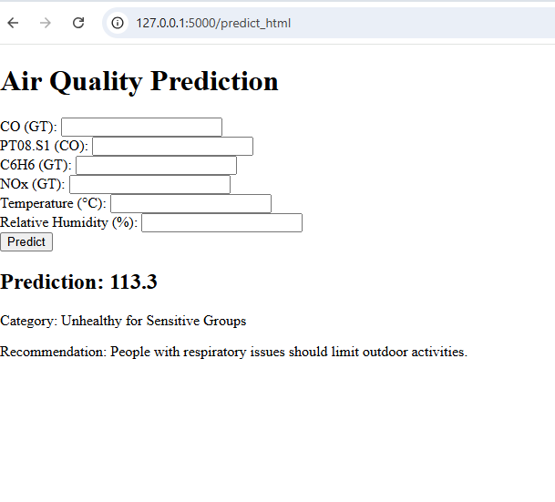

# Air Quality Prediction  

## Overview  
This project predicts air quality based on sensor data using a **Random Forest model**. It provides an API and a web interface for predictions.  

##  Dataset  
- Source: [Air Quality UCI](https://archive.ics.uci.edu/ml/datasets/Air+Quality)  
- Features: CO, NO2, Temperature, Humidity, etc.  

## Technologies Used  
- Python (Flask, Pandas, Sklearn)  
- Machine Learning (Random Forest)  
- HTML, CSS, JavaScript  
- Git & GitHub
  ## 📊 Results  
## Model Performance  
| Metric               | Value  |  
|----------------------|--------|  
| Training R²          | 0.98   |  
| Testing R²           | 0.91   |  
| Cross-Validation R²  | 0.86   |  

### Key Visualizations  
#### 1. Actual vs Predicted NO2  
.png)  
*High accuracy (R²=0.91) in NO2 prediction.*  

#### 2. Feature Importance  
  
*NOx and CO levels were top predictors.* 
## 📡 API Documentation  
**Endpoint**: `POST /predict`  
**Input (JSON)**:  
```json
{  
  "CO(GT)": 2.3,  
  "NOx(GT)": 200,  
  "Temperature": 25.5  
}
## 🌐 Web Interface  
### Input Form  
  

### Prediction Output  
  
*Sample output with health recommendations.*  

##  How to Run  
1. Clone the repository:  
   ```bash
   git clone https://github.com/Ankitashipra/Air-Quality-Prediction.git
